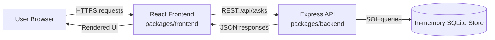
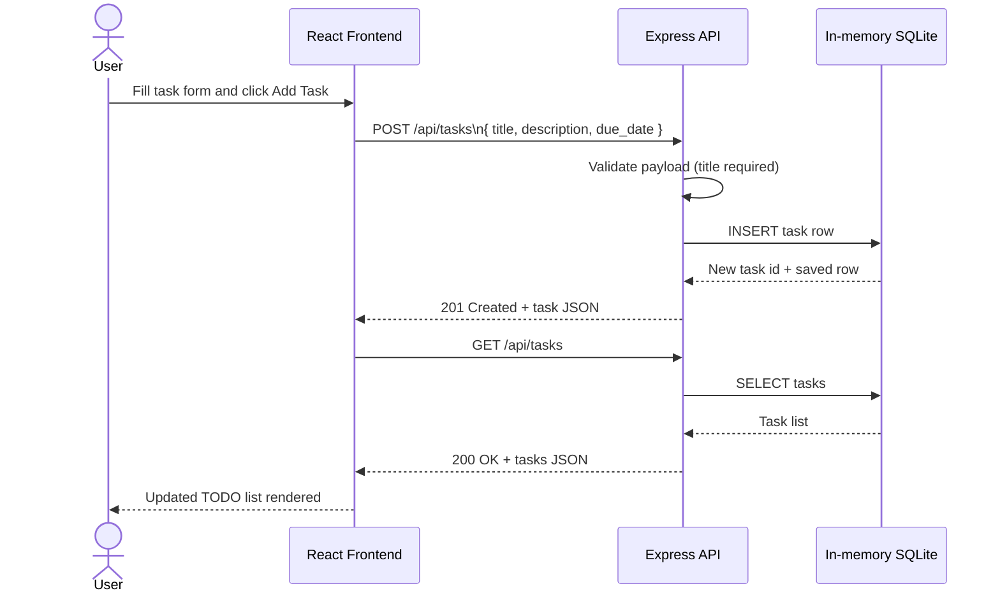

# Cloud Architecture Overview

This document provides a high-level architecture view for the TODO monorepo.

## System Context

```mermaid
flowchart LR
    U[User Browser]
    FE[React Frontend\npackages/frontend]
    API[Express API\npackages/backend]
    DB[(In-memory SQLite Store)]

    U -->|HTTPS requests| FE
    FE -->|REST /api/tasks| API
    API -->|SQL queries| DB
    API -->|JSON responses| FE
    FE -->|Rendered UI| U
```

## Sequence: Create a TODO

```mermaid
sequenceDiagram
    actor User
    participant FE as React Frontend
    participant API as Express API
    participant DB as In-memory SQLite

    User->>FE: Fill task form and click Add Task
    FE->>API: POST /api/tasks\n{ title, description, due_date }
    API->>API: Validate payload (title required)
    API->>DB: INSERT task row
    DB-->>API: New task id + saved row
    API-->>FE: 201 Created + task JSON
    FE->>API: GET /api/tasks
    API->>DB: SELECT tasks
    DB-->>API: Task list
    API-->>FE: 200 OK + tasks JSON
    FE-->>User: Updated TODO list rendered
```
